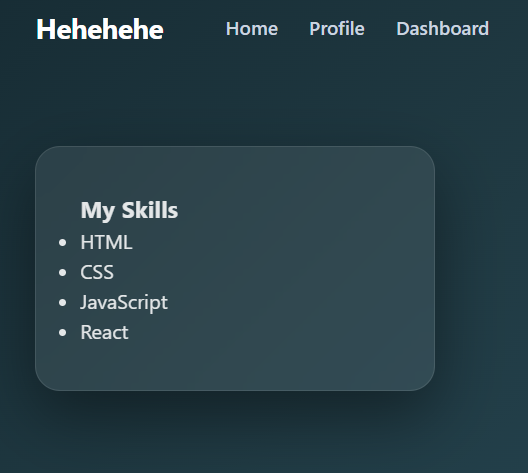
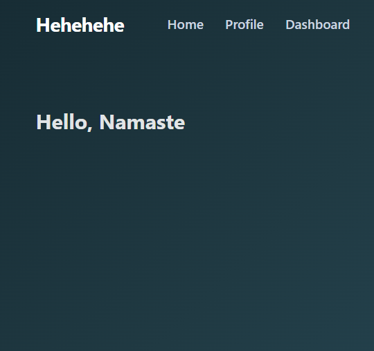

# Experiment 3.3: Multi-Page SPA Using Routing

# Aim
To create a multi-page SPA using client-side routing, demonstrating navigation across multiple distinct views.

# Procedure
Create multiple components, each representing a "page" or distinct view (e.g., Home, Features, Contact, Profile, Skills, About).
Map each component to a unique route path using Route components within Routes.
Implement Link components in the navigation bar or within components to allow users to navigate between these "pages."
Test navigation to ensure all defined routes are accessible and display the correct content without page reloads. This includes forms and data submission within routes.

# Output

