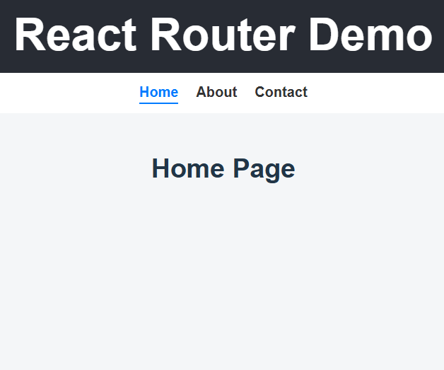
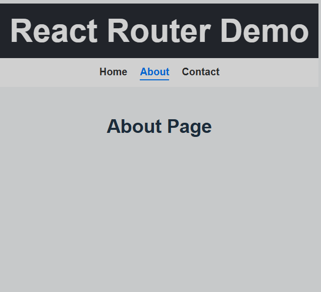
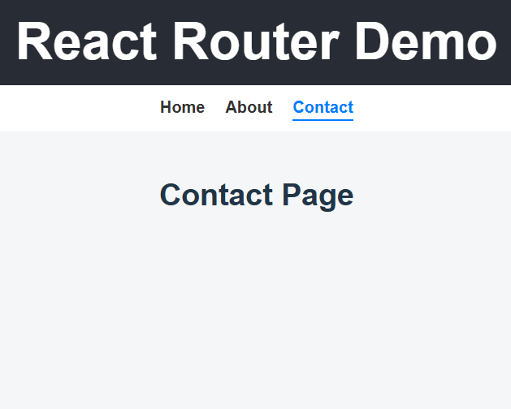

# Experiment 3.1: Basic Client-Side Routing Using React Router

# Aim
To implement basic client-side routing in a Single Page Application using React Router.

# Software Requirements
1. Node.js
2. React
3. React Router DOM
4. Web Browser

# Theory
Routing in a Single Page Application allows navigation between different views without reloading the page. React Router is a popular library used to handle client-side routing in React applications using components such as BrowserRouter, Routes, and Route. This provides a dynamic and fluid user experience.

# Procedure
Create a React application.
Install react-router-dom package.
Wrap the application with BrowserRouter.
Define routes using Routes and Route components, mapping paths to specific components.
Implement basic navigation to test page transitions without a full page reload.

# Output

