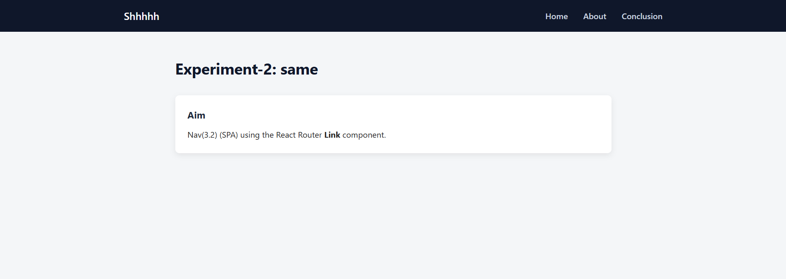
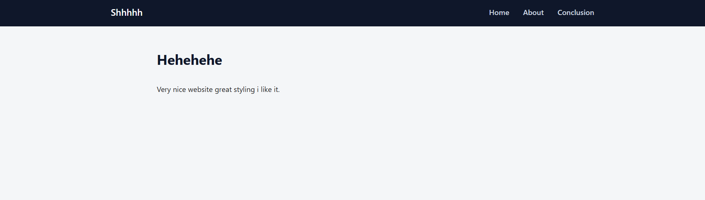
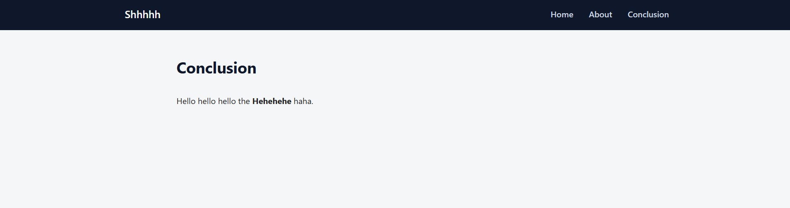

# Experiment 3.2: Navigation Using Link Component

# Aim
To implement navigation links in a SPA using React Router's Link component.

# Procedure
Import Link from react-router-dom.
Create navigation links using the Link component instead of standard <a> tags to prevent page reloads.
Place these links within a navigation bar or menu.
Enable smooth navigation between defined routes.

# Output

